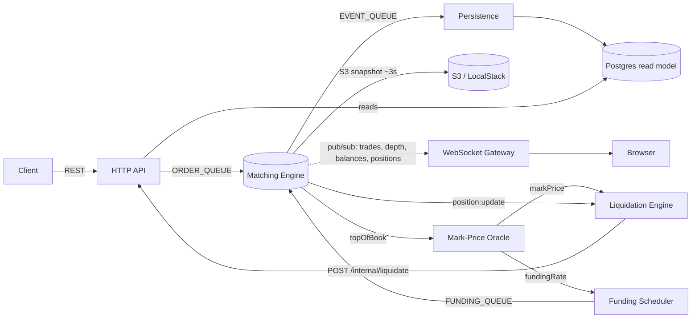

# perps — a perpetual-futures exchange

A from-scratch perpetual-futures trading exchange built as a distributed system:
an in-memory matching engine with durable recovery, real-time market data over
WebSockets, mark-price and funding-rate oracles, and an automated liquidation
engine — wired together over Redis queues and pub/sub, with Postgres as a read
model. All money math uses exact decimals end-to-end (no floats).

> **Status:** runnable end-to-end demo (paper money). The matching/settlement
> core is tested and money-correct; see [Known limitations](#known-limitations)
> for what is intentionally out of scope for a real-funds deployment.

## Architecture

The engine is the single source of truth for the order book, balances, and
positions. It receives commands on a queue, fans out real-time updates over
pub/sub, and streams durable events to Postgres for the HTTP API to read.



**Queues (BullMQ / Redis)** — `ORDER_QUEUE` (Server → Engine), `EVENT_QUEUE`
(Engine → Persistence), `FUNDING_QUEUE` (Scheduler → Engine), `LIQUIDATION_QUEUE`
(Liquidator → its worker → `POST /internal/liquidate` → `ORDER_QUEUE`).

**Pub/Sub (Redis, lossy)** — `trade:update`, `depth:update`, `balance@{userId}`,
`position:update`, `topOfBook:update`, `order:cancelled`, `prices:update`,
`markPrice:update`, `fundingRate:update`.

### Services

| Workspace | Role |
|---|---|
| `apps/server` | HTTP API — auth, balances, orders, positions, depth |
| `apps/web` | Next.js shell (starter stub — not part of the backend demo) |
| `services/engine` | In-memory matching engine; owns book/balances/positions; S3 snapshot + tail-replay recovery |
| `services/persistence` | Consumes `EVENT_QUEUE`, projects the Postgres read model |
| `services/websocket` | Authenticated WebSocket gateway fanning out pub/sub to clients |
| `services/mark-price-engine` | Oracle: derives mark price + funding rate from top of book |
| `services/liquidation-engine` | Watches positions vs. mark price; enqueues liquidations |
| `services/funding-rate-scheduler` | Cron that settles funding every 8h |
| `packages/*` | Shared `db` (Prisma), `queue`, `pubsub`, `types`, `logger` |

## Tech stack

TypeScript · Bun · Turborepo · Express · BullMQ + Redis · Prisma + PostgreSQL ·
decimal.js · AWS S3 (LocalStack in dev) · Docker Compose.

## Quick start (Docker)

Requires Docker + Docker Compose.

```bash
docker compose up --build
```

This builds one shared image, starts Postgres/Redis/LocalStack, runs a one-shot
`init` (pushes the schema + seeds the demo market), then starts all services.
The API is on `:3000`, the WebSocket gateway on `:8080`.

Then run the end-to-end demo (two traders cross a trade):

```bash
sh scripts/demo.sh
```

It registers two users, funds them, crosses a `LIMIT SHORT` (maker) with a
`LIMIT LONG` (taker), and prints the resulting balances and open positions.

## Local development (without Docker)

Start the infrastructure, copy the env templates, then run everything with Turbo:

```bash
docker compose up -d postgres redis localstack   # infra only
for d in apps/server packages/db services/*; do cp "$d/.env.example" "$d/.env" 2>/dev/null; done
bun install
bun run --filter=@repo/db db:push    # push schema
bun run --filter=@repo/db db:seed    # seed demo market
bun run dev                          # all services in watch mode
```

Each workspace documents its variables in its own `.env.example`.

## How recovery works

The engine snapshots its full in-memory state to S3 every ~3s (and after every
200 writes). On boot it loads the latest snapshot and replays the
un-snapshotted tail of completed `ORDER_QUEUE` commands, suppressing side effects
during replay and using a per-command sequence watermark so nothing double-applies.
Postgres is a read model only — never the engine's recovery source. (Try it:
`docker compose restart engine` and watch the boot log recover positions/balances.)

## Tests

```bash
bun run test
```

Covers the money-critical core: order matching (price/size/self-trade
invariants), balance/position conservation, funding application, snapshot
round-trips, replay idempotency, and the liquidation-quantity math. CI
(`.github/workflows/ci.yml`) runs the build + tests on every push and PR.

## Known limitations

Intentionally out of scope for this demo; these are what a real-funds deployment
would add next:

- **Single-instance engine (SPOF).** Correct as one instance; running two would
  corrupt state. No leader election / HA.
- **No insurance fund / ADL.** Funding bad debt is floored at zero and logged;
  liquidation on an empty book can strand a position.
- **Demo-grade security.** Secrets are plaintext env (no vault/rotation), the
  internal liquidation hop uses a single shared static key, and there is no rate
  limiting or password-complexity policy.
- **`EVENT_QUEUE` failure handling.** Failed projection jobs are not retried or
  dead-lettered (the `LIQUIDATION_QUEUE` does have retries + escalation).
- **HTTP/integration test coverage.** The engine and liquidation math are
  well-tested; the controllers and service wiring are not.
